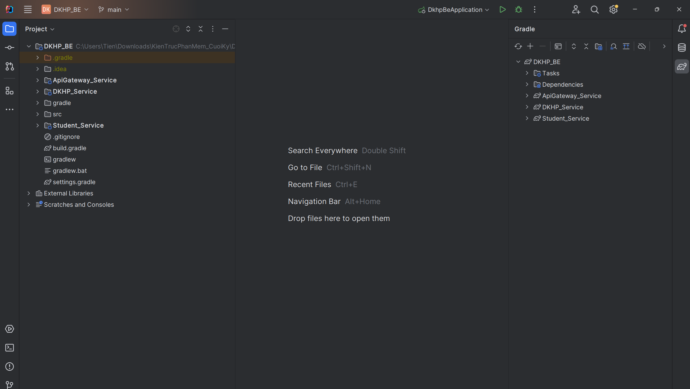
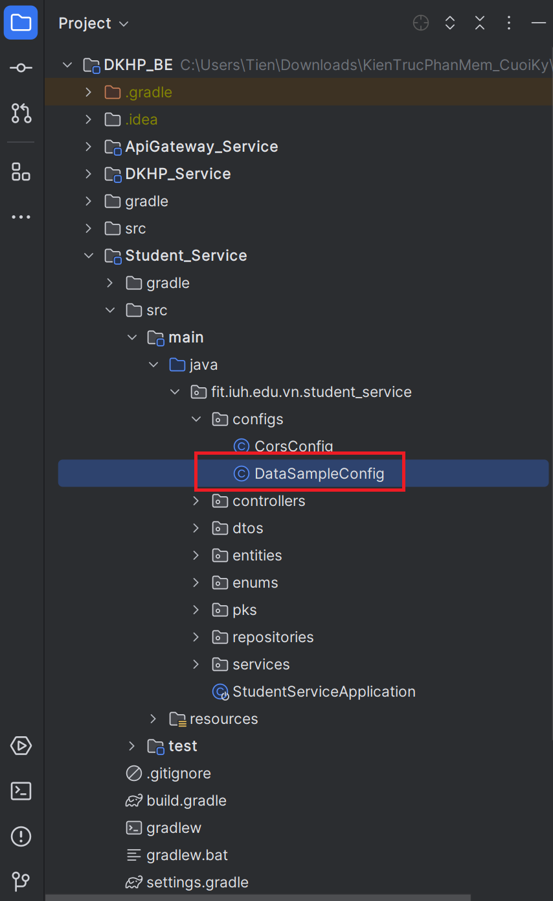
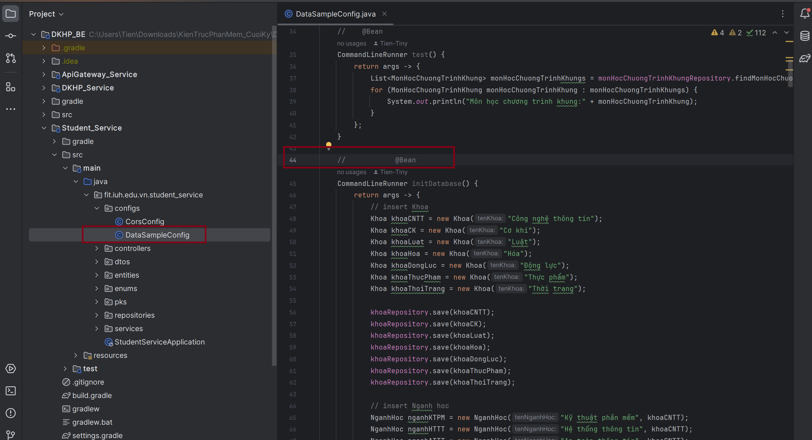
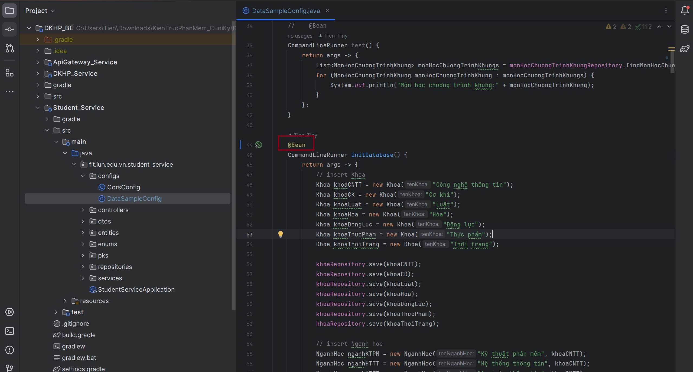
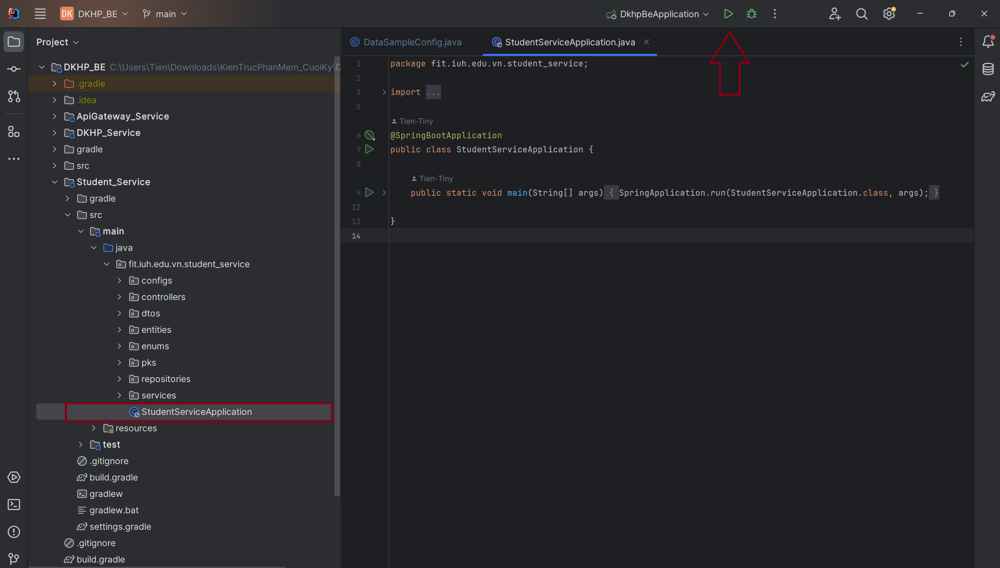
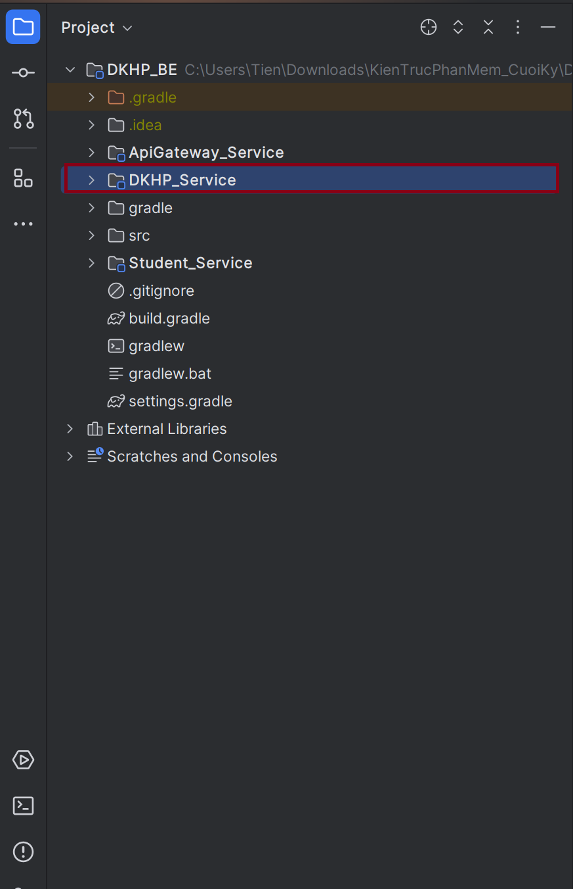
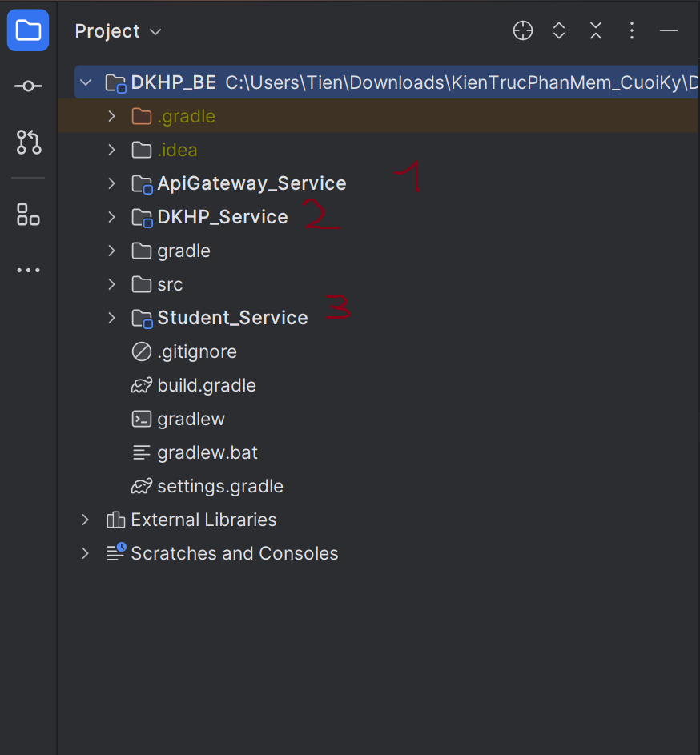

Hướng dẫn sử dụng frontend:
- Sau khi clone project, cd vào Frontend
- Chạy lệnh để cài các dependencies: npm i
- Chạy lệnh để start server: npm start
- Mở http://localhost:3000 trên 1 trình duyệt bất kì
  
Hướng dẫn sử dụng backend:
Đầu tiên sau khi tải về: ta dùng phần mềm Intelij IDEA để mở lên:
Ta sẽ thấy bố cục chung của project như này:

Sau đó ta vào Student_Service vào file DataSampleConfig:

Ta mở comment @Bean của hàm initDatabase:

Sau đó mở lớp StudentServiceApplication rồi chạy để mapping ra csdl và sau khi chạy xong thì nhớ comment @Bean của hàm initDatabase lại(tránh thêm dữ liệu mỗi lần chạy vào csdl):

Tương tự như vậy với DKHP_Service:

Sau khi thực hiện xong các bước trên thì ta nên start lần lược theo thứ tự như sau(và đảm bảo trong quá trình dùng api thì cả 3 phải đều đang chạy):

